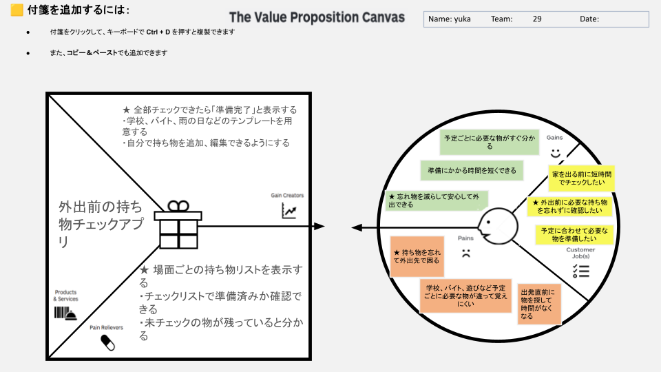

# VPC v1 - ootamanipulator_78058

> 「**自分や周りの人を顧客に設定**」したVPC。13週後の自分が欲しいもの・身近な人のために作りたいものを設計する。
> v1 でいい。完璧を目指さない。第6回でアップデート(v2)します。

---

## 1. 解決したい困りごとを 1つ 選ぶ

> [`bug-list.md`](./bug-list.md) の20個から、**「自分が一番これを解決したい!」と思うもの** を1つ選んでください。
> 1つに絞れなければ、複数候補を書いてOK(後で絞り込みます)。

**選んだ困りごと**:

1. 朝、家を出る直前に財布やイヤホンなどの持ち物を探して、出発が遅れる。

---

## 2. その解決策のアイデアを書く

> 選んだ困りごとに対する「**こうだったらいいのに**」を1つ書く。
> 現実性は気にせず、自由に発想。

**解決のアイデア**:

外出前の持ち物チェックアプリ

---

## 3. VPC本体

> 上で選んだ「困りごと」と「解決のアイデア」を起点に、6要素を埋めていきます。

### 🟦 Customer Profile(顧客=自分自身)

#### Jobs(やりたいこと・動詞で書く)

- 外出に必要な持ち物を忘れずに確認したい（★）
- 予定に合わせて必要な物を準備したい
- 家を出る前に短時間でチェックしたい

#### Pains(困っていること)

- 持ち物を忘れて外出先で困る（★）
- 学校、バイト、遊びなど予定ごとに必要な物が違って覚えにくい
- 出発直前に物を探して時間がなくなる

#### Gains(得たい未来・状態)

- 忘れ物を減らして安心して外出できる（★）
- 予定ごとに必要な物がすぐ分かる
- 準備にかかる時間を短くできる

---

### 🟧 Value Map(あなたが作るもの)

#### Products & Services

- 外出前の持ち物チェックアプリ

#### Pain Relievers

- 場面ごとの持ち物リストを表示する（★）
- チェックリストで準備済みか確認できる
- 未チェックの物が残っていると分かる

#### Gain Creators

- 全部チェックできたら「準備完了」と表示する（★）
- 学校、バイト、雨の日などのテンプレートを用意する
- 自分で持ち物を追加、編集できるようにする

---

## 4. Fit確認(整合チェック)

| Pains/Gains | ↔ | Pain Relievers / Gain Creators | チェック |
|---|---|---|---|
| Pain ① 持ち物を忘れて外出先で困る | ↔ | Pain Reliever ① 場面ごとの持ち物リストを表示する / 未チェックの物が残っていると分かる | ✓ |
| Pain ② 学校、バイト、遊びなど予定ごとに必要な物が違って覚えにくい | ↔ | Pain Reliever ② 場面ごとの持ち物リストを表示する | ✓ |
| Pain ③ 出発直前に物を探して時間がなくなる | ↔ | Pain Reliever ③ チェックリストで準備済みか確認できる | ✓ |
| Gain ① 忘れ物を減らして安心して外出できる | ↔ | Gain Creator ① 全部チェックできたら「準備完了」と表示する | ✓ |
| Gain ② 予定ごとに必要な物がすぐ分かる | ↔ | Gain Creator ② 学校、バイト、雨の日などのテンプレートを用意する | ✓ |
| Gain ③ 準備にかかる時間を短くできる | ↔ | Gain Creator ③ 自分で持ち物を追加、編集できるようにする | ✓ |

> 整合しないものは「自分が作りたいだけ」のプロダクトになりがち。
> 迷ったら AI大学講師に壁打ち。
